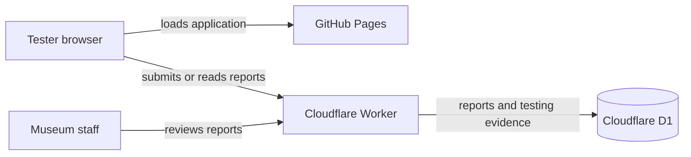

<div align="center">
  

  # Project Lantern

  **A flexible recognition-board control center for museum displays**

  Design donor boards, schedule presentations, manage announcements, and preview
  portrait and landscape displays from one workspace.

  [**Open the live prototype →**](https://ijustcreate.github.io/project-lantern/)
  &nbsp;&nbsp;·&nbsp;&nbsp;
  [Report feedback](https://ijustcreate.github.io/project-lantern/)
  &nbsp;&nbsp;·&nbsp;&nbsp;
  [Developer setup](#developer-setup)

  
  
  
  
  
</div>

---

## Start here

Project Lantern is currently an **active testing prototype**. It is ready for
museum staff and invited testers to explore, but some tools are unfinished and
bugs are expected.

| I want to… | Go here |
| --- | --- |
| Explore the current prototype | [Launch Project Lantern](https://ijustcreate.github.io/project-lantern/) |
| Preview recognition displays | Open **Displays**, then launch a portrait or landscape display |
| Report a problem | Select the floating **Bug** button anywhere in the app |
| Review submitted feedback | Open **Bugs** in the main navigation |
| Run the project locally | Follow [Developer setup](#developer-setup) |
| Understand the hosting model | See [Testing architecture](#testing-architecture) |

> [!IMPORTANT]
> The public prototype is for interface, workflow, and display-layout testing.
> Do not enter passwords, payment information, private donor records, or other
> sensitive museum data.

## What Project Lantern does

Project Lantern brings the main recognition-display workflows into one visual
control center:

- Build donor-recognition boards with configurable layouts, typography,
  backgrounds, panels, and effects.
- Manage donor records, recognition tiers, tags, and presentation content.
- Preview independent portrait and landscape display windows.
- Schedule boards and announcements for different screens.
- Prepare live announcements, camera effects, and presentation sequences.
- Publish revisions and review prior board states.
- Capture structured bug reports with screenshots and technical context.

### Current project status

| Area | Status | Notes |
| --- | --- | --- |
| Board design | Available | Core editor and display renderer are ready for testing |
| Donor management | Available | Suitable for sample data during public testing |
| Portrait and landscape previews | Available | Best tested from a desktop browser |
| Announcements and presentation tools | In development | Some controls may be incomplete |
| Shared tester bug reports | Cloudflare deployment | Reports and testing screenshots use D1 |
| Museum-local persistence | Planned | Final installation will store operational data on the museum computer |
| Cross-device live synchronization | Planned | Public testing currently focuses on interface and layout |

## Testing guide

The fastest useful test takes about five minutes:

1. Open the [live prototype](https://ijustcreate.github.io/project-lantern/) in
   current Chrome or Edge.
2. Explore the **Dashboard**, **Donors**, **Boards**, **Announcements**, and
   **Displays** sections.
3. Create or modify sample content. Public-test data is not museum production
   data.
4. Open a portrait or landscape display and check that the result matches the
   editor preview.
5. If something is confusing or broken, click the floating **Bug** button.
6. Add a short description, optional details, and a screenshot when useful.
7. Save the report. Shared reports appear in the app’s **Bugs** section.

Helpful reports explain:

- what you were trying to do;
- what you expected to happen;
- what actually happened;
- whether it happens every time; and
- which screen, board, or browser you were using.

## Testing architecture

The public application remains on GitHub Pages. Only features that require a
writable server use Cloudflare.



This separation keeps the share link stable and the static application simple:

- **GitHub Pages** publishes the React/Vite frontend from `main`.
- **Cloudflare Worker** exposes the public bug-report API.
- **Cloudflare D1** stores report text, status, comments, metadata, and
  prototype-sized screenshot evidence.
- **Cloudflare R2** is the planned upgrade path if testing later requires large
  videos or full-resolution file archives.
- The future **museum desktop build** will store operational board and donor data
  locally so the exhibit does not depend on public hosting.

## Museum deployment direction

The public prototype and the final museum installation serve different needs.

The hosted prototype is for sharing, review, and feedback. The museum build is
intended to run as a Tauri desktop application on a designated Windows computer,
open dedicated display windows, and persist museum data locally. Export/import
backups will allow staff to recover or move the installation without relying on
the public testing service.

## Developer setup

### Requirements

- Node.js 22
- npm
- A current Chromium-based browser
- Rust and the Windows build tools only when running the native Tauri shell

### Run the web application

```powershell
npm install
npm run dev
```

Open the local URL printed by Vite. Use the monitor button in the top bar or
open **Displays** to launch independent test displays.

### Production verification

```powershell
npm run build
npm run build:worker
```

### Cloudflare resources

The Worker configuration lives in [`wrangler.jsonc`](wrangler.jsonc), its
implementation in [`worker/bugs.ts`](worker/bugs.ts), and the D1 schema in
[`worker/schema.sql`](worker/schema.sql).

After authenticating Wrangler and creating the configured D1 database:

```powershell
npm run cloudflare:migrate
npm run cloudflare:deploy
```

Set the GitHub Actions repository variable `LANTERN_BUG_ENDPOINT` to the
deployed Worker endpoint followed by `/bugs`. The Pages workflow injects that
value as `VITE_LANTERN_BUG_ENDPOINT`.

### Native Tauri shell

```powershell
npm run tauri:dev
```

The native host can create independent portrait and landscape webview windows.
Rust/Cargo and the appropriate Windows build tools must be installed first.

## Repository map

```text
project-lantern/
├── .github/workflows/      GitHub Pages deployment
├── public/                 Static assets, sounds, and branding
├── scripts/                Changelog and bug-work tooling
├── src/                    React application and display renderer
├── src-tauri/              Native Windows/Tauri host
├── worker/                 Cloudflare bug-report API and schema
├── vite.config.ts          Web build and local bug bridge
└── wrangler.jsonc          Cloudflare bindings and deployment settings
```

## Data and privacy

- Use fictional or non-sensitive donor information in the public prototype.
- Bug reports may include the entered description, app state, browser context,
  recent application errors, and small attachments selected by the tester.
- Testers should remove screenshots containing private information before
  submitting.
- Museum production data will move to local storage in the installed desktop
  version.

## Development workflow

Material changes are verified and recorded in the in-app changelog. Bug-specific
analysis and test results are also recorded in the local Lantern bug-work log.

```powershell
npm run bugs -- list --status=open
npm run bugs -- show BUG-0002
npm run changelog -- --help
```

---

<div align="center">
  <strong>Project Lantern</strong><br />
  Built as a practical foundation for a durable, staff-friendly museum
  recognition experience.
</div>
